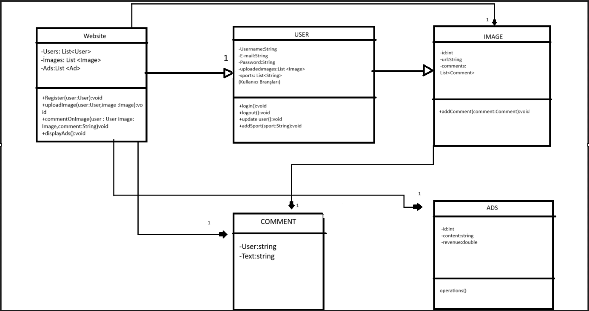

Proje Adı
----------
Sport's Coach(Spor Koçu)

Projenin Amacı
---------------
Profesyonel,yarı Profesyonel veya amatör olarak spor yapan bireyleri birbirleyiriyle iletişim sağlayabilmesi adına tek bir çatı altında toplamak.

Proje Çıktısı
---------------
1.Bulunulan konum dahilinde veya yapılan sporun branşına göre detaylı spor hocası bulma ve randevulaşma
2.Örneğin:Boks yapan bir bireyin ihtiyacına göre mevcut durumda bulunan hoca önerisi,boks branşındaki diğer bireylerle iletişim.
3.Gerek duyuluyorsa(Örneğin:Body Building)yapılan branşa göre supplement desteği(Creatin,vitamin,Omega)

Projenin Hedef Kitlesi
----------------
-Amatör ,yarı profesyone ve profesyonel sporcular.
-Spor hocaları
-Supplement firmaları veya temsilcileri

Projenin Potansiyel Rakipleri
----------------------
www.madmuscles.com
www.armut.com
www.superprof.com

Web sitesi özellikleri
----------------------
-Üyelik yapısı
-Randevu oluşturma
-Anlık destek(online olan spor hocalarının destek verebileceği mini chat)
-Fotoğraf yükleme kaldırma güncelleme
-Feedback & Puanlama
-Profil
-İlan

Projenin Gelir Modeli
-----------------------
-Girişte tek seferlik alınan üyelik ücreti
-Spor hocalarının anlık online verdikleri destekten pay alma
-Supplement komisyonu

